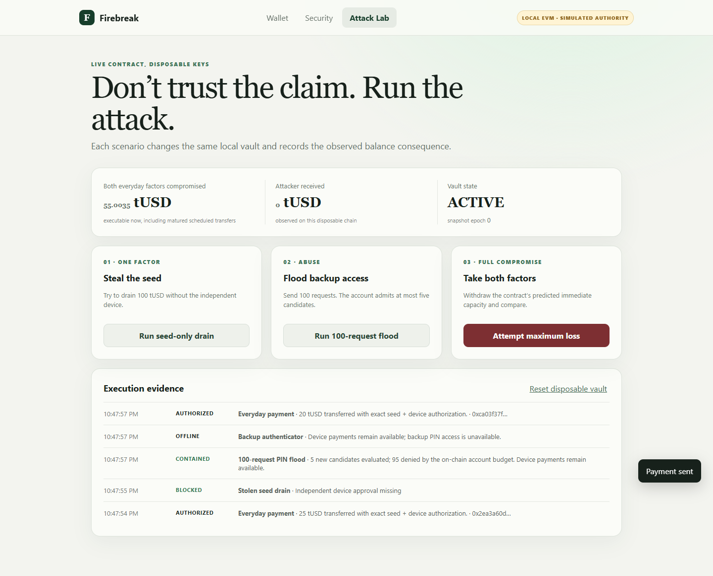
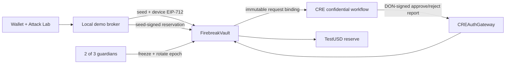

# Firebreak

[](https://github.com/elainaglazer/firebreak/actions/workflows/verify.yml)

**A stablecoin reserve that stays usable every day and gives its owner time to react when credentials fail.**

Wallet security usually asks whether a transaction is authorized. Firebreak asks a second question: **how much loss is executable right now?** It combines exact two-factor signatures, a continuously refilling spending allowance, cancellable delays for large transfers, a rate-limited recovery lane evaluated by a Chainlink Runtime Environment (CRE) confidential workflow, and 2-of-3 guardian recovery that does not depend on the old seed or the recovery service.



## Why it is different

The controls form one failure-containment system rather than a list of toggles:

| Threat | Enforced result |
| --- | --- |
| Seed phrase stolen | Cannot spend without the independent device or a valid backup authorization |
| Seed + device stolen | Immediate loss is bounded by the on-chain token bucket; large transfers wait |
| PIN brute force or request flood | Only five candidate evaluations are admitted per account period on-chain |
| Backup service outage | Normal seed + device payments continue |
| Old credentials and backup service unavailable | Two distinct guardians freeze the vault immediately and rotate both everyday credentials after a delay |
| UI makes a security claim | Attack Lab executes the scenario against the same disposable EVM and shows the observed balance effect |

The `exposureState()` view calculates the amount executable under the stated “both everyday factors compromised” assumption. The Attack Lab withdraws exactly that predicted immediate amount and compares the observed result.

## Run it

Requirements: Node.js 24+ and Chrome for the browser test.

```bash
npm install
npm --prefix workflows/pin-auth install
npm run check:all
npm start
```

Open `http://127.0.0.1:4173`. The demo starts an in-process Ganache chain, deploys fresh contracts, and funds a disposable vault with 1,000 test tUSD. It uses no paid API, RPC, wallet, or hosted service.

## Five-minute judge path

1. On **Wallet**, send 25 tUSD. It executes immediately with exact seed + device EIP-712 signatures.
2. Enter 150 tUSD. The UI tells you before confirmation that it will be scheduled and cancellable.
3. Open **Attack Lab** and run **Steal the seed**. The contract rejects the forged device signature.
4. Run **100-request flood**. Five candidate slots are consumed on-chain; the remaining 95 are denied before private evaluation.
5. Open **Security**, stop the PIN service, return to **Wallet**, and send another payment. The independent device lane remains usable.
6. Begin guardian recovery. Two independent guardian signatures freeze transfers immediately, invalidate pending authority, and rotate the epoch. Complete it after the three-minute demo delay.

## Architecture



`FirebreakVault.sol` has no owner, upgrade proxy, arbitrary-call escape hatch, native-asset withdrawal, or token approval path. Its only outbound token paths are an exact authorized transfer and an immutable delayed transfer. `CREAuthGateway.sol` accepts reports only from its immutable forwarder and binds to one vault once.

The browser broker exists to make the disposable local demonstration one-click. A production client would keep the seed signer, device signer, and guardians on separate user-controlled devices; the broker must never hold them together.

## CRE workflow

`workflows/pin-auth/workflow.ts` is a TypeScript CRE workflow using `handlerInTee` with AWS Nitro in `us-west-2`. It:

1. reads a pepper and account verifier through the CRE secrets API;
2. fetches the single on-chain-reserved candidate request;
3. validates the complete request shape;
4. compares an account-, vault-, chain-, and epoch-bound HMAC in constant work;
5. emits an ABI-encoded report binding the protocol domain, attempt ID, request hash, exact transfer digest, and decision.

The on-chain admission budget is consumed before evaluation, so rotating endpoints or flooding the workflow cannot buy more guesses against one vault. The prototype broker can see the submitted PIN; the workflow protects evaluation and secret material inside the TEE, but this repository does not claim end-to-end encrypted PIN transport.

### Chainlink file inventory

Every file that directly implements or configures the Chainlink integration is linked here for sponsor review:

- [`workflows/pin-auth/workflow.ts`](workflows/pin-auth/workflow.ts) — confidential TEE handler, secret retrieval, private verifier evaluation, and exact report encoding
- [`workflows/pin-auth/main.ts`](workflows/pin-auth/main.ts) — CRE workflow runner entry point
- [`workflows/pin-auth/config.staging.json`](workflows/pin-auth/config.staging.json) — staging workflow configuration shape
- [`contracts/CREAuthGateway.sol`](contracts/CREAuthGateway.sol) — immutable CRE forwarder boundary and protocol/report binding
- [`contracts/FirebreakVault.sol`](contracts/FirebreakVault.sol) — on-chain attempt reservation and consumption of exact CRE authorization decisions

## Verified scope

- Solidity compiles with `solc` 0.8.30 using optimization and IR.
- Twelve adversarial integration tests run against deployed bytecode on a fresh local EVM.
- The CRE workflow typechecks and its account-binding verifier test passes.
- The authenticated official CRE simulator compiles and executes the workflow with production limits, returning `"APPROVE"` for the bound candidate and `"REJECT"` for a wrong candidate; hashes and transcript are in `CRE-SIMULATION.md`.
- The browser test clicks through ordinary payment, stolen-seed rejection, a 100-request flood, backup-service outage, and continued device payment.
- `evidence/firebreak-attack-lab.png` is produced by that browser run.

This is an unaudited hackathon prototype using a permissionless-mint test token and test keys. The successful simulator is not a real TEE or live DON deployment. A live deployment must bind `CREAuthGateway` to the current official CRE forwarder. Do not use it with real assets.

## Repository map

- `contracts/FirebreakVault.sol` — reserve, spend lanes, delay, exposure, and guardian recovery
- `contracts/CREAuthGateway.sol` — narrow CRE report boundary
- `workflows/pin-auth/` — confidential PIN evaluation workflow
- `public/` and `server/` — zero-cost interactive demo
- `test/vault.test.js` — adversarial contract tests
- `SUBMISSION.md` — paste-ready contest copy and recording script
- `SECURITY.md` — assumptions, invariants, and production gaps
- `CRE-SIMULATION.md` — exact official-simulator commands, hashes, and successful run evidence
- `AI-USAGE.md` — entrant contribution and AI-assistance disclosure
- `docs/planning/` — product decisions, threat simulations, and implementation specification

## License

MIT
