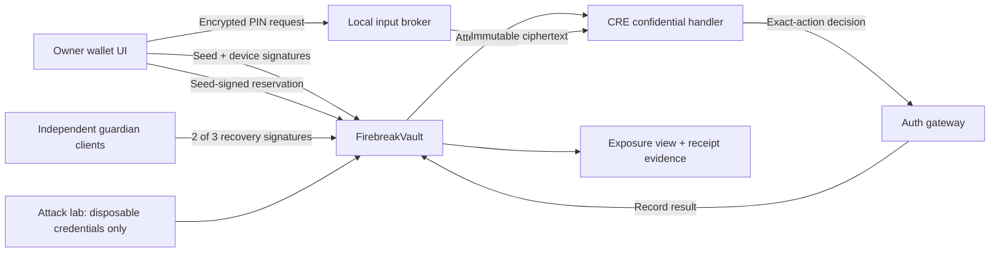

# Firebreak: implementation blueprint

Prepared September 11, 2026. Objective: build a distinctive, reproducible hackathon submission that can compete for a sponsor award, with zero additional cash expenditure. This is a proposed design, not implemented or audited software. No prize probability is asserted.

Read 00-PRODUCT-AND-UX-DECISIONS.md first. It refines this technical draft after a usage/security walkthrough, makes the normal single-confirmation path a product goal, and moves the attack lab outside everyday navigation. Its product priorities take precedence.

## 1. The product and the contribution

Build a single-asset smart vault that preserves owner access during a stolen-key attack, limits immediate spending after everyday credentials are compromised, and recovers through independent guardians when authentication infrastructure is unavailable.

Pitch: **“Steal the key. Exhaust the login attempts. Stop the authentication service. The owner still has a way back.”**

The differentiator is an executable compromise report: select compromised credentials, inspect the exposure derived from current contract state, run an actual attack against a disposable vault, and compare the observed outcome with the predicted bound. Do not claim that the underlying primitives or their combination are globally novel. Do not describe the report as formal verification or an audit.

One user story: a freelancer holds a stablecoin reserve. Their backup key leaks. An attacker exhausts PIN attempts; the freelancer continues using an enrolled device. If everyday credentials also leak, the attacker can only spend the remaining immediate allowance or queue a delayed withdrawal. Guardians freeze and recover the vault.

## 2. Prize target, cash constraint, and preflight

Primary candidate: ETHOnline 2026 / Chainlink / Best Confidential Workflow. The official track currently lists up to two $1,000 awards and accepts successful CRE Confidential Workflow simulation or live deployment. A meaningful confidential handler and execution evidence are required. This is eligibility guidance, not a guarantee of acceptance or an award.

Current official template says live Confidential Workflows are private beta; the simulator is not a TEE. The app must distinguish LOCAL SIMULATION, SEPOLIA + SIMULATED AUTH, and VERIFIED LIVE CRE if that last mode is actually achieved. Never display “enclave protected” in simulation.

Zero cash means:

- Use installed/free tools and existing model access. No paid model APIs in the product.
- Local EVM and disposable test token are the default. Sepolia uses faucet ETH only if accessible without spending money.
- No mainnet, paid RPC, domain purchase, card-required hosting, hardware purchase, payment subscription, or paid tunnel.
- A local runnable repo plus recorded demo is the delivery baseline. Public testnet and free static hosting are optional enhancements, not silent expenditures.
- Check event registration, whether late entry is possible, any deposit/waiver, deadline with timezone, AI disclosure rules, and submission requirements through the participant dashboard. These are NOT verified by this document. A refundable deposit still violates the zero-cash constraint unless the user explicitly changes it.
- An official sponsor page says submissions close September 13, 2026. September 16 is the event end, not the build deadline. Confirm the exact cutoff in the dashboard immediately.
- Do not submit a from-scratch project as Continuity. Do not assume all sponsor tracks accept local-only demos.

First technical milestone, before building the polished UI: run the official confidential-handler template locally, then prove that the chosen confidential-input decryption and secret comparison compile and execute inside that handler. Save actual execution evidence. Timebox this preflight to about 90 minutes. If unavailable, keep building the independently useful vault and state the sponsor blocker accurately. Do not relabel ordinary backend code as CRE.

Do not add Privy by default. It becomes a secondary candidate only after the primary demo is complete, free account access is confirmed, and a real protected transfer using a Privy-created first-factor wallet works. The primary device and recovery credentials must remain independent. Do not spend the deadline adding brand badges.

## 3. Scope decisions: implement these, not alternatives

- One EVM chain per deployment; no cross-chain auth budget.
- One immutable, conventional ERC-20 asset per vault. Local demo asset is `TestUSD`, six decimals, clearly not real USDC or money. No fee-on-transfer or rebasing support.
- Solidity vault, no proxy, owner admin, arbitrary execution, delegatecall, token approvals, plugin installation, or signature service for arbitrary external protocols.
- No ERC-4337 bundler/paymaster dependency and no EIP-7702 delegation. Ordinary transactions may relay signed vault actions.
- Immutable spending capacity, refill period, transfer delay, recovery delay, guardian set, and authentication gateway.
- A real independent device signer first. A WebAuthn passkey adapter is a later enhancement only if its verification is actually complete.
- A successful PIN authorization is for one exact action; no reusable authenticated session that unlocks all spending.
- Independent 2-of-3 guardian recovery; no seed-only escape hatch.
- The UI is a wallet plus an attack lab. No chatbot, AI risk score, token, DAO, chain analytics dashboard, or automated mainnet scanning.

## 4. Components and trust boundaries



Components:

1. `FirebreakVault.sol`: all authorization and spending enforcement.
2. `FirebreakFactory.sol`: optional simple deployment convenience; no authority over deployed vaults. Omit until needed.
3. `TestUSD.sol`: local-only/testnet mintable demonstration token. Mint never affects production claims.
4. `AuthGateway`: a narrow, configured decision receiver; simulation implementation and live CRE receiver must be separate artifacts.
5. Confidential workflow: reads a reserved attempt, decrypts the one bound PIN request, checks the protected credential record, emits a decision tied to its action.
6. Input broker / worker: persists ciphertext, schedules execution, deduplicates retries, and caches results. Does not have owner or guardian keys.
7. Shared TypeScript package: ABI, EIP-712 types, integer units, deployment manifest, and scenario definitions.
8. React/TypeScript UI and command-line attack runner.

The on-chain PIN budget does not force a malicious authenticator to be honest. An authenticator holding the PIN verification secrets can violate the off-chain evaluation policy. A compromised authenticator plus the seed can satisfy the backup lane. State these assumptions. A TEE changes the trust boundary; it does not eliminate it. No threshold OPRF or decentralized password verification is implemented here.

For simulation, the local operator controls the authenticator and can inspect its secrets. That is a prototype trust assumption, visibly disclosed in the lab and documented in SECURITY.md.

## 5. Credentials and authority

| Credential | Authority | Cannot do alone |
|---|---|---|
| Seed signer S | Sign transfer actions; reserve PIN attempts | Spend, enroll device, change policy, recover |
| Independent device signer D | Co-authorize transfers; cancel queued transfers | Spend or rotate keys |
| Auth gateway A | Record an exact reserved PIN attempt's decision | Spend without S, change policies, recover |
| Any 2 distinct guardians G1/G2/G3 | Start recovery, freeze, cancel recovery, replace S and D after delay | Act with only one guardian |
| Relayer | Pay gas and submit existing signed requests | Invent authorization |

All addresses are nonzero; S, D and guardian signer addresses must be distinct in the first ECDSA implementation. Reject duplicate guardians. Generate secrets independently; never derive D or guardians from S. Local automated tests may possess all test keys, but the attacker subprocess gets only the fixture's explicitly compromised keys.

For the initial UI, use a separate browser profile/client for D. Label it “independent device key,” not “hardware protected” or “passkey.” A same-machine demonstration does not prove resistance to whole-device malware. Keep all secret keys out of frontend bundles and repository commits; deliberately public seed fixtures are prominently marked test-only.

Optional passkey adapter: implement ERC-1271 verification using a pinned OpenZeppelin WebAuthn verifier, with user verification, exact challenge, RP ID and origin checks. Registration requires existing authorization or guardian recovery; no fallback acceptance on parse/verification error. Verify compatibility and test wrong origin/RP ID/challenge before replacing the ECDSA device mode. Do not invent WebAuthn verification.

## 6. Contract state and typed actions

Use pinned OpenZeppelin EIP712, ECDSA/SignatureChecker, SafeERC20, and ReentrancyGuard. Do not manually implement signature recovery. Specify and test supported signature encodings.

Domain: name `FirebreakVault`, version `1`, runtime chainId and verifyingContract. Every action includes current security epoch and an expiry. Use different EIP-712 type hashes for Transfer, ReserveAttempt, CancelTransfer, BeginRecovery, and CancelRecovery. Use abi.encode, not ambiguous packed encodings.

Transfer fields:

```
Transfer(uint256 epoch,uint256 nonce,address recipient,uint256 amount,uint8 mode,uint256 deadline)
mode = 0 IMMEDIATE, 1 DELAYED
```

Asset is immutable in the contract. Never let a caller supply an alternative token. Reject zero amount, zero recipient, the vault itself as recipient, invalid mode, expired actions, and old epochs. Deadlines for delayed requests apply to queue creation; the queued permission's execution timing is its separate eta.

Use a mapping of used transfer nonces per epoch (or action digest) rather than a global sequential nonce. A seed-only attacker reserving PIN attempts must not invalidate the device lane's pending actions. Nonces are caller-selected 256-bit random values and consumed on actual transfer/queue creation, not when merely reserving a PIN attempt.

State overview:

```
immutable asset, capacity, refillPeriod, transferDelay, recoveryDelay
immutable guardians[3], authGateway, credentialId, pinAttemptCap, pinPeriod
seedSigner, deviceSigner, epoch, frozen, pinEnabled
remainingCredit, creditUpdatedAt
usedTransferNonces[epoch][nonce]
usedReservationNonces[epoch][nonce]
attempts[attemptId]
pendingTransfers[pendingId]
reservedTotal
recoveryNonce, activeRecovery
```

Every action emits a useful event. Never emit PINs, verifier records, private keys, authentication plaintext, or sensitive error detail. Receipts and events establish execution evidence; an indexer is not authoritative state.

Suggested external surface (descriptive signatures; keep ABI consistent across packages):

```
executeDevice(Transfer action, bytes seedSig, bytes deviceSig)
reserveAttempt(Transfer action, ReserveAttempt reservation, bytes seedSig)
recordAuthResult(bytes32 attemptId, bytes32 requestHash, bool approved)
executePin(bytes32 attemptId)
executeQueued(bytes32 pendingId)
cancelQueued(bytes32 pendingId, uint256 deadline, bytes deviceSig)
beginRecovery(Recovery proposal, bytes[] guardianSignatures)
completeRecovery()
cancelRecovery(uint256 recoveryNonce, uint256 deadline, bytes[] guardianSignatures)
availableCredit() view
exposureState() view
```

Pin execution uses the stored action whose digest was included in the seed-signed reservation; that reservation explicitly authorizes execution of that action only if approved. Do not depend on msg.sender being the owner. Correctly bound signatures allow any relayer to submit the same authorized action without changing its effect.

## 7. Spending policy: precisely bounded, no moving goalposts

Use a **token bucket**, not a calendar-day counter. Initial full bucket capacity C = 100 TestUSD; continuous refill C per 24 hours; delayed transfers wait 24 hours. These are demonstration defaults, not recommended financial settings.

Compute in token base units with multiplication before division:

```
creditNow = min(C, storedCredit + floor((now - lastUpdate) * C / refillPeriod))
```

Clamp elapsed time before multiplication when already sufficient to fill the bucket. Every immediate spend materializes creditNow, deducts amount, and sets lastUpdate to now. Integer rounding is conservative: never round credit upward. Never reset credit after authentication, restart, or recovery.

IMMEDIATE: require unfrozen, valid authorization, unused action nonce, amount <= available credit, and amount <= balance - reservedTotal. Consume nonce and credit before SafeERC20 transfer. Whole transaction reverts on failed transfer.

DELAYED: same authorization, but reserves amount from unreserved balance and stores recipient, amount, eta = now + transferDelay, and current epoch. Consume action nonce; increase reservedTotal. This does not consume immediate credit. Enforce at most 16 active pending transfers, using a bounded list and bounded cleanup. Never iterate an unbounded history.

Queued transfers execute permissionlessly at/after eta while unfrozen and in current epoch, once only. They transfer only the stored recipient/amount and decrease reservedTotal. D may cancel a queued transfer with an exact typed cancellation before execution; cancellation is idempotence-protected by the pending status. Once executed it cannot be cancelled. If execution is already eligible, cancellation can lose a race; disclose this.

No recipient allowlist in v1: that adds mutable administrative rules. All large transfers use the same explicit delay. No native ETH withdrawals or arbitrary-call escape hatch. Do not solicit native ETH deposits into the vault; relay gas lives elsewhere.

Never claim “100 per rolling day”: token-bucket bursts and refill have different semantics. Over duration H, newly authorized immediate spending is bounded above by creditNow + C*H/refillPeriod, subject to balance and integer rounding. Delayed obligations require separate accounting.

## 8. PIN protocol and abuse resistance

Use five evaluated requests per account per fixed 30-day period for the first version. Every reservation counts, successful or failed; successful login does not reset the budget. This is “five attempts per period,” not five failures. The UI must show the period boundary; an attacker may use budgets on both sides of a boundary. Device lane is unaffected.

ReserveAttempt includes epoch, unique reservation nonce, actionDigest, requestHash, and expiry. Period index is floor(block.timestamp / pinPeriod). attemptId is derived from vault, epoch and reservation nonce; it is not chosen by the broker. Reject reservations while frozen, after backup disablement, or when budget exhausted. Transaction commits the reservation and budget decrement before any PIN evaluation.

Request privacy and binding:

1. The client constructs plaintext containing version, chainId, vault, epoch, reservation nonce, actionDigest, PIN, and expiry.
2. Encrypt the complete message with an existing HPKE implementation and fresh sender randomness. Target suite: RFC 9180 X25519/HKDF-SHA256/AES-256-GCM, only if the selected libraries/runtime support it. Do not implement the crypto construction manually.
3. The workflow decryption public key comes from a pinned deployment manifest; the public key commitment belongs in the immutable auth configuration or deployment verification. Pinning a malicious replacement key must not silently succeed.
4. Publish only hash(ciphertext), never hash(PIN), PIN plus public salt, or a public PIN verifier. Bind encryption context to protocol version and vault/chain. Include all context inside the authenticated plaintext and check it after decryption.
5. Store ciphertext under attemptId in the broker only after verifying the reservation. Subsequent writes must have exactly the same ciphertext hash. No overwrite endpoint.

Workflow steps:

- Read authoritative chain reservation and current epoch/status, checking its finalized/confirmed inclusion according to the configured chain. Local chain has immediate controlled finality; Sepolia confirmation assumptions are documented.
- Validate ciphertext hash against reservation before decryption.
- Decrypt inside handler; compare every embedded context field to reservation state.
- Fetch protected per-credential secret record. Compare HMAC-SHA256(pepper, canonical(credentialId, vault, chainId, epoch, PIN)) to a stored private verifier using constant-time comparison. Neither pepper nor verifier is public. This is a prototype private verifier, not OPAQUE and not proof against complete verifier compromise.
- Return only the attempt id, request hash, action digest/epoch context and boolean decision to the gateway/report path.
- Mark malformed ciphertext or expired/incorrect credential requests rejected; reservation remains spent. A transient infrastructure error also does not refund or reopen the attempt.

Initial enrollment is a trusted local provisioning step, not an unauthenticated public API: generate independent factors and secret records, deploy vault, bind credential records to actual address/chain/epoch, verify all configured keys, then fund with test assets. There is no seed-only PIN reset or registration endpoint. Generate fresh secrets with the setup command. Do not put a static known PIN in the web bundle.

If HPKE cannot execute in the actual CRE runtime, report the precise compatibility blocker. A local broker receiving plaintext PIN can be used only as an explicitly documented reduced-trust development mode; it cannot support an end-to-end confidential-input claim. Complete the integration preflight before promising the stronger mode.

Concurrency and retries:

- SQLite with transactions and unique key (chain, vault, epoch, attemptId) is enough for the local single-host broker. Use one persistent database for every worker; per-process maps are inadequate.
- State machine RECEIVED -> PROCESSING -> APPROVED/REJECTED/ERROR. Duplicate calls reuse the immutable request and cached result.
- Leases can retry the same immutable evaluation after crashes. Do not promise exactly-once computation across crashes; promise at most one distinct PIN candidate per reservation. A repeated deterministic evaluation of the same ciphertext is not a new guess.
- Validate body size (for example 8 KB), signature, reservation, and expiry before accepting work. Bounded global queue and concurrency; per-wallet fair scheduling. IP limits are supplemental, not the account's security boundary.
- No endpoint that evaluates an unreserved candidate, including debug, enrollment, health, or error endpoints. Debug mode never exists in published deployed contract code.
- Reject wrong hashes without evaluating their candidate. Server restart cannot clear on-chain reservations or budget.
- The relayer has an independent small gas quota and only sends validated calls. Anyone may self-relay valid device or recovery actions through another RPC.

Threat claim: resistance to authentication flooding and lockout of the device lane. Not volumetric DDoS protection or guaranteed chain/RPC availability. Limits hold while the verifier follows the protocol; the contract independently enforces authorizations and spending limits even if the verifier cheats.

## 9. Auth gateway: two explicit modes

Simulation: `SimulationAuthGateway` is a test authority controlled by a local development signer. Only that signer may record a workflow result. The bridge records an actual workflow run id and result digest in evidence logs, but the EOA signature does not prove TEE execution. Use it only with obvious simulation labeling. Vault tests must show that even total gateway compromise cannot spend without an S-authorized reservation/action.

Live: adapt the official CRE EVM report-receiver pattern. Authenticate the real forwarder and expected workflow metadata/identity using the official supported verifier. Decode and validate the exact report, then call the vault result recorder. Do not accept arbitrary msg.sender, arbitrary reports from any workflow, or a user-provided forwarder. Do not invent report signature validation or assume simulation grants live access.

Vault result recording requires configured gateway caller, reserved attempt, matching request/context and epoch, not previously resolved, not expired. Duplicate same results may safely no-op or revert; conflicting results must never replace a terminal decision. Approval is not spending. executePin checks unfrozen/current epoch/deadline, consumes the shared action nonce, then enforces the exact same spending policy as device execution.

The publicly available demo must not have a “force approve” API. Local test fixtures can directly control the simulation gateway as a modeled attacker, clearly separate from the application authentication flow.

## 10. Independent recovery, with no attacker veto

Recovery proposal includes current epoch, recoveryNonce, newSeedSigner, newDeviceSigner, and signature deadline. Two distinct enrolled guardians sign identical EIP-712 data. Include explicit vault/chain domain. New keys are nonzero, independent, and different from the compromised old keys.

beginRecovery validates quorum and no active recovery. It immediately freezes all outbound activity, increments epoch, invalidates/clears all bounded pending transfers and reservations from the old epoch, sets reservedTotal to zero, disables PIN lane, and stores proposed keys plus readyAt = now + recoveryDelay. Deposits remain possible. Materialize spending credit without resetting it.

completeRecovery is permissionless after readyAt and installs only the stored new S and D, increments epoch again, clears proposal, and unfreezes. It does not need the old keys, PIN, broker, or gateway. PIN remains disabled. The recovered owner uses the device path and can migrate to a freshly provisioned vault if a backup PIN path is desired.

cancelRecovery requires a fresh matching guardian quorum signature and consumes its nonce. It invalidates the active proposal, advances epoch, leaves the vault FROZEN and PIN disabled. Cancellation does not silently restore compromised owner credentials. Guardians can start a replacement recovery. Everyday keys cannot cancel, alter, extend, or repeatedly restart recovery.

No standalone single-key global freeze in v1. D can cancel individual queued withdrawals; guardian quorum starts a full lockdown. This avoids granting a low-assurance credential an unlimited denial-of-service switch.

Recovery quorum is a powerful trust assumption: two compromised guardians can eventually take control. One compromised guardian can do nothing; losing two guardians and all everyday factors can make recovery unavailable. Funds are not recoverable from the seed alone by design.

## 11. Compromise report: the distinctive feature

All values come from one block snapshot. Show snapshot block/time and mode. All math uses base-unit integers. Do not mix latest balance with older queue state. No fiat price feeds: amounts are units of the configured asset.

At timestamp t define:

```
B = current asset balance
Q = reservedTotal for active current-epoch queued transfers
M = total of those transfers with eta <= t
L = availableCredit(t)
U = max(0, B - Q)
```

If unfrozen and no new signatures are available:

- Newly authorized seed-only transfer capacity: zero unless the attacker also finds the PIN or holds a prior applicable approval. Do not claim zero probability of a correct guess.
- Captured approved PIN action can authorize only its exact stored action once before expiry; show separately if the scenario includes it.
- Seed + device, or seed + malicious verifier: new immediate capacity min(U,L).
- Matured preauthorized transfers: M may leave now to their fixed recipients, even if the caller has no credentials. Identify this as preauthorized outflow, not automatically theft.
- Total currently executable outflow with both factors: M + min(U,L), bounded by B.
- Guardian quorum alone: cannot instantly withdraw before recovery delay, but can freeze immediately and gain control through recovery. Clearly show eventual authority.
- Frozen state: all outbound capacity zero until recovery completes. Show remaining recovery delay.

Also show each queued amount/recipient/eta, earliest pending execution time, and which independent keys can intervene. Label “current instant exposure” separately from future refill and delayed exposure. Do not call “zero now” a guarantee of safety forever. After the transfer delay an attacker retaining both factors may execute newly queued large withdrawals if nobody intervenes.

The report accepts explicit assumptions: compromised factors, captured approvals, and pending obligations. It is a deterministic explanation for this contract, not a general wallet risk scanner.

Scenario evidence output: scenario id, deployment/chain/block, assumed credentials, action digest, expected rule, transaction hash or actual revert, before/after balance, relevant queue/budget state, observed delta, and match/mismatch. Saved JSON should be machine-readable; UI presents a concise trace. Local execution traces may prove failure for a reverted call; do not fabricate mined transactions for eth_call simulations.

Comparison baseline: deploy an explicitly unprotected test account holding the same test asset. With a disposable leaked key, show the baseline can be drained while the protected vault rejects the equivalent seed-only transfer. This compares policies; never imply every other wallet lacks controls.

## 12. Required attacks and tests

Contracts are security-critical: write meaningful negative tests, state-machine tests, and bounded property/fuzz tests. Do not settle for successful-transfer tests only.

1. S-only and D-only immediate/queued transfer attempts fail.
2. Wrong chain, vault, epoch, nonce reuse, altered recipient/amount/mode/deadline signatures fail.
3. Valid device path and valid PIN path each transfer exactly once.
4. One action cannot execute once through each path; share nonce consumption across lanes.
5. Invalid seed signatures cannot reserve attempts. Five valid reservations exhaust that period. One hundred concurrent distinct requests do not gain a sixth candidate evaluation.
6. Duplicate retries/cross-worker retries use identical ciphertext and candidate. A changed ciphertext never reuses a reserved id.
7. Reservation budget persists after rejected, abandoned, expired and crashed workflow attempts, and broker restart.
8. Device transaction still works with PIN budget exhausted and broker stopped. ReserveAttempt cannot invalidate device nonces.
9. Backend/gateway-only compromise cannot create an S-authorized transfer; S+gateway remains subject to allowance/delay.
10. Token splitting cannot exceed the available immediate bucket; test boundary timestamps and conservative rounding. Deposits never reset allowance.
11. Delayed funds are reserved, cannot be double-spent immediately, cannot execute early, and execute once to exact stored recipient.
12. Pending queue cap holds; cancellation and recovery free reserved funds without a transfer or bucket reset.
13. Exposure calculation includes matured queued outflow. Test a nonempty queue, zero liquidity, partial bucket, and frozen state.
14. One guardian or the same guardian signature twice fails. Quorum signatures on a different proposal fail.
15. Recovery freezes immediately, ignores the old signer as a veto authority, waits full delay, installs only proposed keys, and works without authenticator.
16. Old transfer signatures, pending withdrawals, PIN approvals, and recovery messages stay invalid after epoch transitions.
17. Recovery cancellation leaves frozen state; old keys cannot resume spending. Fresh quorum can replace recovery.
18. New keys can operate after recovery; old keys cannot; PIN remains disabled; credit was not refilled by recovery.
19. Unauthorized result writers/forged workflow metadata fail. Conflicting terminal auth results fail.
20. No ABI function grants token approvals, arbitrary calls, seed-only policy changes, proxy upgrades, or default-owner authority.
21. Fuzz random sequences of deposits, authorized/unauthorized requests, time advancement, queue actions and recovery; assert no negative accounting, no reservedTotal above balance for the supported token, and no outbound transfers while frozen.
22. Input privacy check: PIN absent from public calldata, logs, exported evidence, source bundles and request hashes that can be checked offline. Document simulation operator access explicitly.

Use fake clock advancement only in a clearly marked local test/lab profile. Deploy shorter immutable delay settings to a fresh demo vault for presentation; expose them. Never put an admin time-travel function in the actual vault or pretend 30 seconds proves 24 hours elapsed on Sepolia.

## 13. Implementation organization

Suggested repo:

```
contracts/                 Solidity source, unit + invariant tests
apps/web/                  owner UI and attack lab
services/auth-broker/      input storage, worker, simulation bridge
workflows/pin-auth/        actual CRE workflow
packages/shared/           ABI, EIP-712 definitions, units, scenario schema
scripts/                   local setup, deployment, attack runner, evidence export
docs/                      architecture, threat model, sponsor integration, feedback
evidence/                  sanitized recorded test results and manifests
```

Use React + Vite + TypeScript + viem for UI. Use Foundry for contracts if already available, otherwise a current supported Hardhat setup. Pick one test chain and one package manager; lock all dependencies. Use the CRE language/template that passes confidential-input preflight; TypeScript is preferred only if actually supported by the chosen crypto runtime. A small Go workflow is acceptable. Do not rewrite libraries to force a single-language stack.

Owner secrets remain client-side. Relay and broker secrets remain server-side. .env.example contains placeholders, not real keys. Local setup creates ignored secret files with restrictive permissions where supported. Never export secret-bearing debug logs as evidence.

Build stages and acceptance gates:

**Gate 0 — access and sponsor preflight:** confirm zero-cost path, event eligibility questions, actual CRE simulation + confidential handler/crypto compatibility. Record unresolved items.

**Gate 1 — vault kernel:** two ECDSA factors, immediate bucket, bounded delayed queue, exact signatures, guardian recovery, negative tests. A CLI scenario runs without UI.

**Gate 2 — backup authentication:** immutable request reservation, encrypted candidate, private verifier inside actual workflow, persistent deduplication, gateway integration, budget and restart tests.

**Gate 3 — executable report:** exposure view backed by contract state, attack runner, automated predicted/observed comparisons, JSON evidence, unprotected baseline.

**Gate 4 — presentation:** clean UI, Sepolia deployment if free, walkthrough recording, reproducible README, threat model and sponsor mapping.

**Optional after those pass:** genuine WebAuthn device signer, independently runnable guardian page, free static owner/recovery interface, meaningful Privy integration. Do not begin optional work while a required attack fails.

If time is short, drop optional passkeys, factory polish and secondary sponsor integration. Preserve the tested core, actual primary sponsor workflow, and evidence. Do not downgrade security silently to keep a screenshot working.

## 14. UI and presentation direction

Use a restrained financial application: neutral background, clear type, one accent color, readable amounts. No neon hacker background, invented trust score, animated shields, marketing landing page, or scrolling sponsor wall.

Three views:

1. Wallet: balance, remaining immediate allowance and refill semantics, transfer form, pending transfers and cancellation.
2. Security: independent credentials, PIN attempts/period, guardian recovery and state. Mode badge is always visible.
3. Attack lab: assumptions, predicted exposure, run action, observed receipts and balances. Dangerous controls target only allowlisted disposable deployments; never accept an arbitrary funded mainnet address.

Each attack card follows one pattern: attacker capability -> attempted action -> contract decision -> balance consequence. Clearly distinguish “actually executed,” “reverted call,” and “simulated.” An unexpected result displays a failure, never a reassuring success animation.

Three-minute demo target:

- 0:00–0:25: reveal disposable seed, drain unprotected baseline, protected transfer fails.
- 0:25–0:55: PIN burst exhausts five reservations; registered device still pays.
- 0:55–1:25: explain actual confidential workflow and show one real successful run; state simulation mode in one sentence if applicable.
- 1:25–2:05: assume both everyday credentials stolen, show exposure bound, attempt split transfers and queue a large withdrawal.
- 2:05–2:40: stop authenticator, quorum freezes and recovers with shortened visibly configured local delay; old action fails.
- 2:40–3:00: evidence report and exact trust assumptions. Explain sponsor's necessary role.

Do not narrate eight features without demonstrating them. Keep the owner story central.

## 15. Submission package and honest claims

Deliver README with exact setup commands, pinned versions, one-command local test/demo, architecture diagram, threat model, deployed addresses/modes if any, test output, sanitized attack evidence, actual CRE workflow source and execution evidence, demo video, and a short sponsor-integration mapping. Include genuine developer feedback from encountered tooling problems, plus required event AI/tool disclosure after verifying the rules.

Explain the human contribution concretely: threat-model choices, scenario design, security review, testing and demo decisions. Do not claim work that the user did not do. Do not invent testing, users, audit results, performance numbers, novelty, or sponsor endorsement.

Allowed claims when demonstrated:

- The seed alone does not authorize transfers from this vault.
- Exhausting the backup authentication budget does not disable the independent device path.
- Immediate new spending after everyday-factor compromise is bounded by current credit, excluding separately disclosed preauthorized outflow.
- Independent guardian recovery operates without the PIN service.
- The attack lab reproduces these properties on the submitted deployment/profile.

Disallowed claims:

- Unhackable, DDoS-proof, formally verified, audited, world's first, guaranteed zero loss, threshold authentication, or production-ready.
- A simulation provides real enclave protection.
- Five attempts forever, five failures if all attempts count, or a daily hard limit when the implementation is a token bucket.
- Full server compromise cannot enable offline PIN guessing.

Do not deploy with real assets. An actual public deployment or submission must use the user's authorized account, event eligibility, and verified configuration. No paid external action is permitted under this brief.

## 16. Primary sources and items to recheck

Sources checked September 11, 2026; verify current requirements when implementing.

- Chainlink prize: https://ethglobal.com/events/ethonline2026/prizes/chainlink
- Confidential workflow template and simulation limitations: https://docs.chain.link/cre-templates/hello-confidential-workflows
- CRE docs and receiver patterns: https://docs.chain.link/cre
- Privy prize (optional): https://ethglobal.com/events/ethonline2026/prizes/privy
- Event participant information: https://ethglobal.com/events/ethonline2026/info
- Sponsor page listing September 13 submission close: https://developers.ledger.com/ethonline
- OpenZeppelin cryptography and WebAuthn helpers: https://docs.openzeppelin.com/contracts/5.x/api/utils/cryptography
- EIP-712: https://eips.ethereum.org/EIPS/eip-712
- HPKE specification (read before selecting a library): https://www.rfc-editor.org/rfc/rfc9180.html

Outstanding verification: participant registration/deposit/waiver and exact deadline; current AI-use policy; CRE CLI/runtime and HPKE compatibility; live beta access if desired; a free faucet; local-only overall-event submission acceptability. None should silently become a paid dependency.
